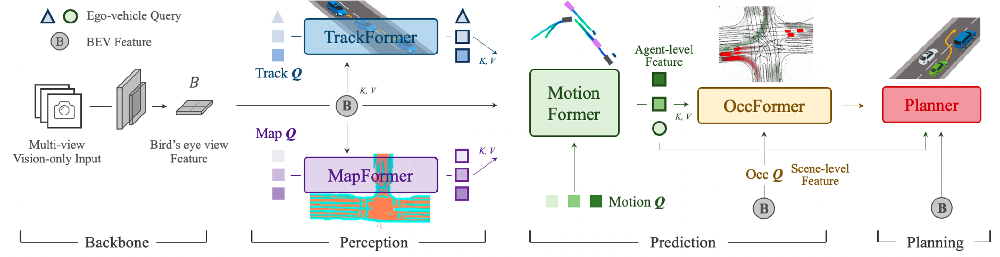

## 현식 업데이트

## 추가
- UniAD/ckpts #체크포인트
- UniAD/data #데이터
- UniAD/projects/work_dirs #학습로그 (자동생성)

## 가이드:

- ```conda activate base```
- ```conda remove --name 환경이름 --all```

## env setting -- hyuntry01
- ```conda create -n hyuntry01 python=3.8 -y```
- ```conda env list``` #가상환경 생성 목록 확인
- ```conda activate hyuntry01```
- ```conda env list``` #가상환경 설치 목록 확인

- cd ~ = /root
- cd /
- cd /home/hyun/local_storage/code

- ctrl+shift+p : >select interpreter : 가상환경이름

- vscode Python 설치

- ```conda install -c omgarcia gcc-6```

## Torch install - cudatoolkit=11.3 / Torch=1.10.1 
- ```conda install pytorch==1.10.1 torchvision==0.11.2 torchaudio==0.10.1 cudatoolkit=11.3 -c pytorch -c conda-forge -y``` #설치
- ```conda list cudatoolkit -f``` #확인 11.3.1
- ```python -c "import torch; print(torch.__version __)"``` #확인 1.10.1

- ```export PATH=/usr/local/cuda-11.3/bin:$PATH``` #경로지정

- ```export CUDA_HOME=/usr/local/cuda-11.3``` #MMCV 설치 전 HOME 지정
- ```export CUDA_HOME=/mnt/cuda-11.3/``` #MMCV 설치 전 HOME 지정 #상민이형


## install mmcv
- ```pip install mmcv-full==1.4.0 -f https://download.openmmlab.com/mmcv/dist/cu113/torch1.10.0/index.html``` #설치
- ```pip show mmcv-full``` #확인 

## install mmdet, mmseg
- ```pip install mmdet==2.14.0``` #설치
- ```pip show mmdet``` #확인

- ```pip install mmsegmentation==0.14.1``` #설치
- ```pip show mmsegmentation``` #확인

## install mmdet3d
- (hyuntry01) hyun@Hoshino:~/code$ /home/hyun/code #경로 주의 / #가이드: cd ~ 
- ```git clone https://github.com/open-mmlab/mmdetection3d.git```
- ```cd mmdetection3d```
- ```git checkout v0.17.1```
- ```pip install scipy==1.7.3```
- ```pip show scipy``` #확인
- code/mmdetection3d/requirements/runtime.txt  / # networkx, numpy #주석처리
- ```pip install scikit-image==0.20.0```
- ```pip show scikit-image``` #확인 
- ```pip install -v -e .```


## install UniAD
- (hyuntry01) hyun@Hoshino:~/code$ /home/hyun/code #경로 주의 / #가이드: cd ~ 
- ```git clone https://github.com/OpenDriveLab/UniAD.git```
- ```cd UniAD```
- ```pip install -r requirements.txt``` #numpy 1.20.0 주석처리
- ```pip show numpy``` #확인  -> 1.22.4


## install pretrained weights
- ```cd UniAD```
- ```mkdir ckpts && cd ckpts```
- ```wget https://github.com/zhiqi-li/storage/releases/download/v1.0/bevformer_r101_dcn_24ep.pth```
- wget ```https://github.com/OpenDriveLab/UniAD/releases/download/v1.0/uniad_base_track_map.pth```
- wget ```https://github.com/OpenDriveLab/UniAD/releases/download/v1.0.1/uniad_base_e2e.pth```
- cd ..


## data
- ```hyun_ver01 cd UniAD```
- ```mkdir data && cd data```
- ```ln -s /home/sangmin/local_storage/nuscenes``` /home/hyun/local_storage/code/UniAD/data #nuScenes 심볼릭링크
- ```ln -s /home/sangmin/local_storage/data/nuscenes /home/hyun/local_storage/code/UniAD/data```  <-AIS2

- ```cd data```
- ```mkdir infos && cd infos```
- ```wget https://github.com/OpenDriveLab/UniAD/releases/download/v1.0/nuscenes_infos_temporal_train.pkl```
- ```wget https://github.com/OpenDriveLab/UniAD/releases/download/v1.0/nuscenes_infos_temporal_val.pkl```

- ```hyun_ver01 cd UniAD/data```
- ```cd data```
- ```mkdir others && cd others```
- ```wget https://github.com/OpenDriveLab/UniAD/releases/download/v1.0/motion_anchor_infos_mode6.pkl```

- test파일 import mmdet 확인 - 에러1

## Evaluation Example
- hyun_ver03 cd UniAD
- ```nohup ./tools/uniad_dist_eval.sh ./projects/configs/stage1_track_map/base_track_map.py ./ckpts/uniad_base_track_map.pth 8 &```
- ```disown -h```
- ```nohup ./tools/uniad_dist_eval.sh ./projects/configs/stage1_track_map/base_track_map.py ./ckpts/uniad_base_track_map.pth 8 > output.log 2>&1 &```
- ```disown -h```
- ```nohup ./tools/uniad_dist_eval.sh ./projects/configs/stage2_e2e/base_e2e.py ./ckpts/uniad_base_e2e.pth 8 > output.log 2>&1 &```
- ```disown -h```


- ```pip install mmengine```
- ```pip install IPython```
- ```pip install numpy==1.22.4```
- ```pip install Verify```
- ```pip install yapf==0.40.1```


- test, train 파일 import os 밑에 2줄 추가
- ```import sys <br/> sys.path.append(os.path.dirname(os.path.abspath(os.path.dirname(__file__))))```


<div align="center">   
  
# Planning-oriented Autonomous Driving
</div>


<h3 align="center">
  <a href="https://arxiv.org/abs/2212.10156">arXiv</a> |
  <a href="https://www.youtube.com/watch?v=cyrxJJ_nnaQ">Video</a> |
  <a href="https://opendrivelab.com/e2ead/UniAD_plenary_talk_slides.pdf">Slides</a>
</h3>


https://github.com/OpenDriveLab/UniAD/assets/48089846/bcf685e4-2471-450e-8b77-e028a46bd0f7


<br><br>



## Table of Contents:
1. [Highlights](#high)
2. [News](#news)
3. [Getting Started](#start)
   - [Installation](docs/INSTALL.md)
   - [Prepare Dataset](docs/DATA_PREP.md)
   - [Evaluation Example](docs/TRAIN_EVAL.md#example)
   - [GPU Requirements](docs/TRAIN_EVAL.md#gpu)
   - [Train/Eval](docs/TRAIN_EVAL.md)
4. [Results and Models](#models)
5. [TODO List](#todos)
6. [License](#license)
7. [Citation](#citation)

## Highlights <a name="high"></a>

- :oncoming_automobile: **Planning-oriented philosophy**: UniAD is a Unified Autonomous Driving algorithm framework following a planning-oriented philosophy. Instead of standalone modular design and multi-task learning, we cast a series of tasks, including perception, prediction and planning tasks hierarchically.
- :trophy: **SOTA performance**: All tasks within UniAD achieve SOTA performance, especially prediction and planning (motion: 0.71m minADE, occ: 63.4% IoU, planning: 0.31% avg.Col)

## News <a name="news"></a>

- **`Paper Title Change`**: To avoid confusion with the "goal-point" navigation in Robotics, we change the title from "Goal-oriented" to "Planning-oriented" suggested by Reviewers. Thank you!

- **`Planning Metric`**: Discussion [Ref: https://github.com/OpenDriveLab/UniAD/issues/29]: [Clarification](https://github.com/OpenDriveLab/UniAD/issues/29#issuecomment-1583070151) and [Notice](https://github.com/OpenDriveLab/UniAD/issues/29#issuecomment-1717594344) regarding open-loop planning results comparison.

- **`2023/08/03`** Bugfix [[Commit](https://github.com/OpenDriveLab/UniAD/commit/2e1380143d7af7c93bd67725a11d6960fa4347c6)]: Previously, the visualized planning results were in opposition on the x axis, compared to the ground truth. Now it's fixed.

- **`2023/06/12`** Bugfix [Ref: https://github.com/OpenDriveLab/UniAD/issues/21]: Previously, the performance of the stage1 model (track_map) could not be replicated when trained from scratch, due to mistakenly adding `loss_past_traj` and freezing `img_neck` and `BN`. By removing `loss_past_traj` and unfreezing `img_neck` and `BN` in training, the reported results could be reproduced (AMOTA: 0.393, [stage1_train_log](https://github.com/OpenDriveLab/UniAD/releases/download/v1.0/uniad_reproduce_stage1_gpu16_train.log)).

- **`2023/04/18`** New feature: You can replace BEVFormer with other BEV Encoding methods, e.g., LSS, as long as you provide the `bev_embed` and `bev_pos` in [track_train](https://github.com/OpenDriveLab/UniAD/blob/cb4e3dc336ac9f94897ef3c7d85edba85a507726/projects/mmdet3d_plugin/uniad/detectors/uniad_track.py#L394) and [track_inference](https://github.com/OpenDriveLab/UniAD/blob/cb4e3dc336ac9f94897ef3c7d85edba85a507726/projects/mmdet3d_plugin/uniad/detectors/uniad_track.py#L661). Make sure your bevs and ours are of the same shape.
- **`2023/04/18`** Base-model checkpoints are released.


- **`2023/03/29`** Code & model initial release `v1.0`.
- **`2023/03/21`** :rocket::rocket: UniAD is accepted by CVPR 2023, as an **Award Candidate** (12 out of 2360 accepted papers)!
- **`2022/12/21`** UniAD [paper](https://arxiv.org/abs/2212.10156) is available on arXiv.


## Getting Started <a name="start"></a>
- [Installation](docs/INSTALL.md)
- [Prepare Dataset](docs/DATA_PREP.md)
- [Evaluation Example](docs/TRAIN_EVAL.md#example)
- [GPU Requirements](docs/TRAIN_EVAL.md#gpu)
- [Train/Eval](docs/TRAIN_EVAL.md)

## Results and Pre-trained Models <a name="models"></a>
UniAD is trained in two stages. Pretrained checkpoints of both stages will be released and the results of each model are listed in the following tables.

### Stage1: Perception training
> We first train the perception modules (i.e., track and map) to obtain a stable weight initlization for the next stage. BEV features are aggregated with 5 frames (queue_length = 5).

| Method | Encoder | Tracking<br>AMOTA | Mapping<br>IoU-lane | config | Download |
| :---: | :---: | :---: | :---: | :---:|:---:| 
| UniAD-B | R101 | 0.390 | 0.297 |  [base-stage1](projects/configs/stage1_track_map/base_track_map.py) | [base-stage1](https://github.com/OpenDriveLab/UniAD/releases/download/v1.0/uniad_base_track_map.pth) |


### Stage2: End-to-end training
> We optimize all task modules together, including track, map, motion, occupancy and planning. BEV features are aggregated with 3 frames (queue_length = 3).

<!-- 
Pre-trained models and results under main metrics are provided below. We refer you to the [paper](https://arxiv.org/abs/2212.10156) for more details. -->

| Method | Encoder | Tracking<br>AMOTA | Mapping<br>IoU-lane | Motion<br>minADE |Occupancy<br>IoU-n. | Planning<br>avg.Col. | config | Download |
| :---: | :---: | :---: | :---: | :---:|:---:| :---: | :---: | :---: |
| UniAD-B | R101 | 0.363 | 0.313 | 0.705 | 63.7 | 0.29 |  [base-stage2](projects/configs/stage2_e2e/base_e2e.py) | [base-stage2](https://github.com/OpenDriveLab/UniAD/releases/download/v1.0.1/uniad_base_e2e.pth) |

### Checkpoint Usage
* Download the checkpoints you need into `UniAD/ckpts/` directory.
* You can evaluate these checkpoints to reproduce the results, following the `evaluation` section in [TRAIN_EVAL.md](docs/TRAIN_EVAL.md).
* You can also initialize your own model with the provided weights. Change the `load_from` field to `path/of/ckpt` in the config and follow the `train` section in [TRAIN_EVAL.md](docs/TRAIN_EVAL.md) to start training.


### Model Structure
The overall pipeline of UniAD is controlled by [uniad_e2e.py](projects/mmdet3d_plugin/uniad/detectors/uniad_e2e.py) which coordinates all the task modules in `UniAD/projects/mmdet3d_plugin/uniad/dense_heads`. If you are interested in the implementation of a specific task module, please refer to its corresponding file, e.g., [motion_head](projects/mmdet3d_plugin/uniad/dense_heads/motion_head.py).

## TODO List <a name="todos"></a>
- [ ] All configs & checkpoints
- [ ] Upgrade the implementation of MapFormer from Panoptic SegFormer to [TopoNet](https://github.com/OpenDriveLab/TopoNet), which features the vectorized map representations and topology reasoning.
- [ ] Support larger batch size
- [ ] [Long-term] Improve flexibility for future extensions
- [x] Fix bug: Unable to reproduce the results of stage1 track-map model when training from scratch. [Ref: https://github.com/OpenDriveLab/UniAD/issues/21]
- [x] Visualization codes 
- [x] Separating BEV encoder and tracking module
- [x] Base-model configs & checkpoints
- [x] Code initialization


## License <a name="license"></a>

All assets and code are under the [Apache 2.0 license](./LICENSE) unless specified otherwise.

## Citation <a name="citation"></a>

Please consider citing our paper if the project helps your research with the following BibTex:

```bibtex
@inproceedings{hu2023_uniad,
 title={Planning-oriented Autonomous Driving}, 
 author={Yihan Hu and Jiazhi Yang and Li Chen and Keyu Li and Chonghao Sima and Xizhou Zhu and Siqi Chai and Senyao Du and Tianwei Lin and Wenhai Wang and Lewei Lu and Xiaosong Jia and Qiang Liu and Jifeng Dai and Yu Qiao and Hongyang Li},
 booktitle={Proceedings of the IEEE/CVF Conference on Computer Vision and Pattern Recognition},
 year={2023},
}
```
## Related resources

[](https://awesome.re)
- [BEVFormer](https://github.com/fundamentalvision/BEVFormer) (:rocket:Ours!)
- [ST-P3](https://github.com/OpenPerceptionX/ST-P3) (:rocket:Ours!)
- [FIERY](https://github.com/wayveai/fiery)
- [MOTR](https://github.com/megvii-research/MOTR)
